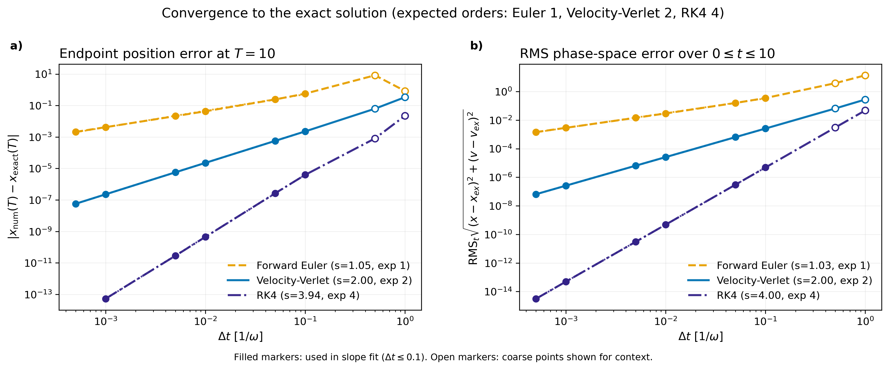
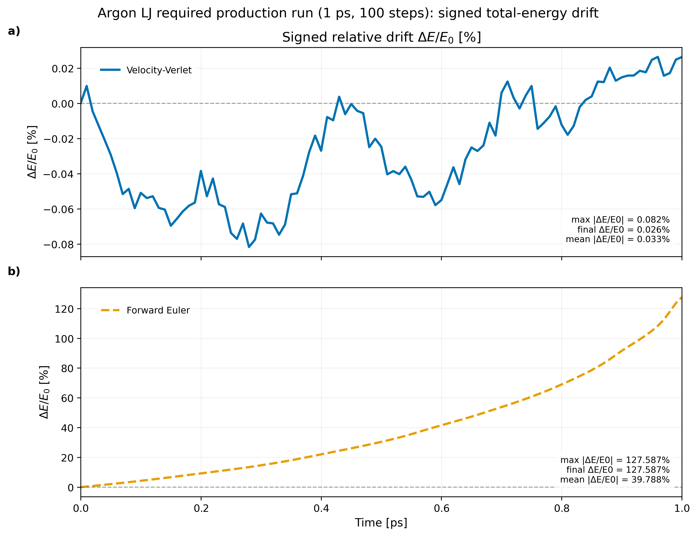
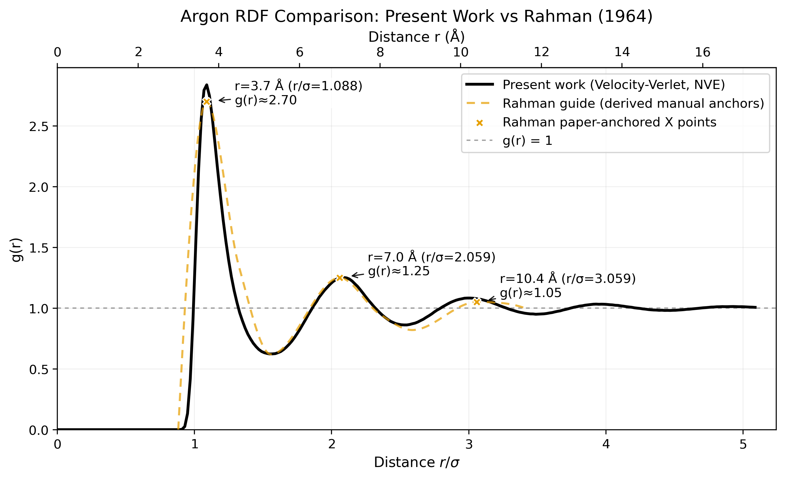
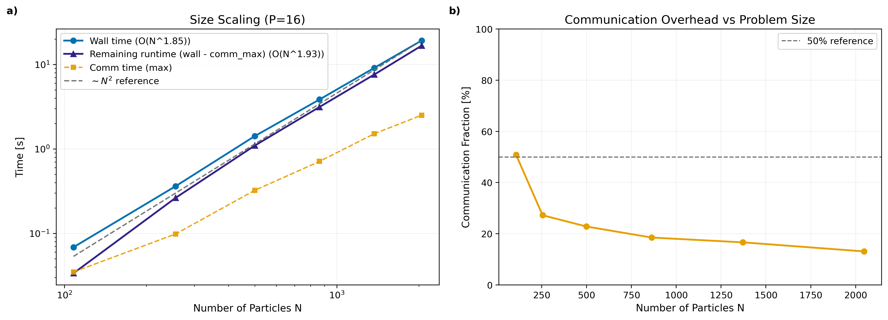
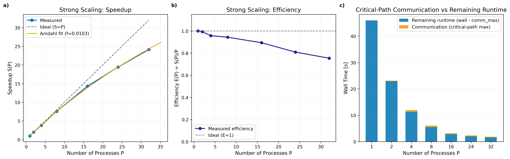

# MPI Parallelisation of Molecular Dynamics

> **Graded 93%.** Selected to feed into an ongoing research publication.

A C++17 / MPI molecular-dynamics solver written for the MPhil in Scientific Computing at the University of Cambridge. Velocity-Verlet integration for a 1D anharmonic oscillator and a 3D Lennard-Jones fluid, with a domain-decomposed parallel force computation.

**Full write-up:** [WA2_MPI_Parallelisation_of_Molecular_Dynamics.pdf](WA2_MPI_Parallelisation_of_Molecular_Dynamics.pdf)

---

## What's in here

- C++17 + MPI, domain-decomposed pair-force computation
- Velocity-Verlet integrator, validated to second-order accuracy
- Reproduces Rahman's 1964 radial distribution function for liquid argon
- Strong and problem-size scaling measured on a multi-node HPC cluster

---

## Results

### 1. Integrator is second-order accurate

Energy-drift error scales as O(Δt²) on the 1D anharmonic oscillator — confirming Velocity-Verlet is implemented correctly.

<p align="center">
  
</p>

### 2. Lennard-Jones fluid — physics validation

Energy is conserved over the production run, and the simulated RDF matches [Rahman (1964)](https://doi.org/10.1103/PhysRev.136.A405) for liquid argon.

<table>
  <tr>
    <td width="50%"></td>
    <td width="50%"></td>
  </tr>
  <tr>
    <td align="center"><sub>Energy conservation over 100-step production run</sub></td>
    <td align="center"><sub>Radial distribution function vs Rahman (1964)</sub></td>
  </tr>
</table>

### 3. Parallel scaling

Linear cost growth with N at fixed process count, and strong-scaling speedup up to 64 MPI processes with a breakdown showing where communication starts to dominate.

<table>
  <tr>
    <td width="50%"></td>
    <td width="50%"></td>
  </tr>
  <tr>
    <td align="center"><sub>Problem-size scaling at fixed p = 16</sub></td>
    <td align="center"><sub>Strong scaling, speedup, and cost breakdown</sub></td>
  </tr>
</table>

---

## Source layout

The solver, tests, and scripts live under [md-mpi/](md-mpi/). See [md-mpi/README.md](md-mpi/README.md) for full build, test, and run instructions.

```
md-mpi/
├── include/      # headers
├── src/          # solver source
├── tests/        # unit tests
├── scripts/      # data generation, plotting, validation
└── Makefile
```

## Build and run

```bash
cd md-mpi
make
make test
bash scripts/run_results.sh
```

Requires `mpicxx`, an MPI runtime, a C++17 compiler, and Python 3 with `numpy` and `matplotlib`.
